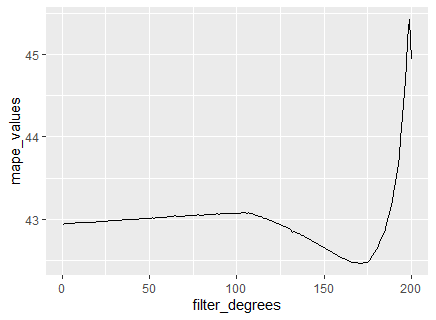

# Title

**Type:** Bachelor's Thesis

**Author:** Florian Christen

**Supervisor:** xxx (only if different from the 1st or the 2nd Examiner)

**1st Examiner:** Prof. Dr. Lessmann    

**2nd Examiner:** Prof. Dr. Fabian


## Table of Content

- [Summary](#summary)
- [Working with the repo](#Working-with-the-repo)
    - [Dependencies](#Dependencies)
    - [Setup](#Setup)
- [Reproducing results](#Reproducing-results)
    - [Training code](#Training-code)
    - [Evaluation code](#Evaluation-code)
    - [Pretrained models](#Pretrained-models)
- [Results](#Results)
- [Project structure](-Project-structure)

## Summary

Der Code in diesem Reposirotry hat das Ziel zu untersuchen, wie sich ein voriges Filtern von Daten auf die Modellperformance auswirkt. Untersucht wurde dabei der Kalman Filter, ein Simple Exponential Smoothing Filter und eine Moving Average Filter. Als Forecastingmethoden wurde Moving Average Forecasting und Forecasting mittels Simpler Exponentieller Glättung verwendet.
Als Datensatz diente ein aufbereiteter Hotel-PMS Export, welcher aus Datenschutzgründen nicht zur Verfügung gestellt werden kann. Die verwendete Performancemetrik ist MAPE.

**Keywords**: Kalman Filter, MA-Filter, SES-Filter, Forecasting, Time Series Models

**Full text**: [include a link that points to the full text of your thesis]
*Remark*: a thesis is about research. We believe in the [open science](https://en.wikipedia.org/wiki/Open_science) paradigm. Research results should be available to the public. Therefore, we expect dissertations to be shared publicly. Preferably, you publish your thesis via the [edoc-server of the Humboldt-Universität zu Berlin](https://edoc-info.hu-berlin.de/de/publizieren/andere). However, other sharing options, which ensure permanent availability, are also possible. <br> Exceptions from the default to share the full text of a thesis require the approval of the thesis supervisor.  

## Working with the repo


### Dependencies

Alle Analysen wurden mit der R-Version 4.3.2 durchgeführt. Verwendete Packages sind in den Code-Files aufgeführt.
Da keine Rohdaten mit zur Verfügung gestellt werden ist der erste Schritt die Datenaufbereitung durchzuführen. Dazu muss das entsprehende Einlesen der Daten und alle damit verbundenen Aufgaben im Sinne des Pre-Processing durchgeführt werden. Darunter zählen das aufteilen in einen Trainings und Testdatensatz, und das aufsetzen der Datenreihen als Zeitreihe. Der eingereichte Programmcode kann für diese Schritte als Leitfaden dienen.

### Setup


## Reproducing results

Um die Resultate in Form der Plots nachzustellen können die CSV-Dateien welche die tabellarische Grundlage für die Plots enthalten verwendet werden.

### Training code

Does a repository contain a way to train/fit the model(s) described in the paper?

### Evaluation code

Does a repository contain a script to calculate the performance of the trained model(s) or run experiments on models?

### Pretrained models

Does a repository provide free access to pretrained model weights?

## Results


Does a repository contain a table/plot of main results and a script to reproduce those results?

## Project structure

(Here is an example from SMART_HOME_N_ENERGY, [Appliance Level Load Prediction](https://github.com/Humboldt-WI/dissertations/tree/main/SMART_HOME_N_ENERGY/Appliance%20Level%20Load%20Prediction) dissertation)

```bash
├── README.md
├── requirements.txt                                -- required libraries
├── data                                            -- stores csv file 
├── plots                                           -- stores image files
└── src
    ├── prepare_source_data.ipynb                   -- preprocesses data
    ├── data_preparation.ipynb                      -- preparing datasets
    ├── model_tuning.ipynb                          -- tuning functions
    └── run_experiment.ipynb                        -- run experiments 
    └── plots                                       -- plotting functions                 
```
